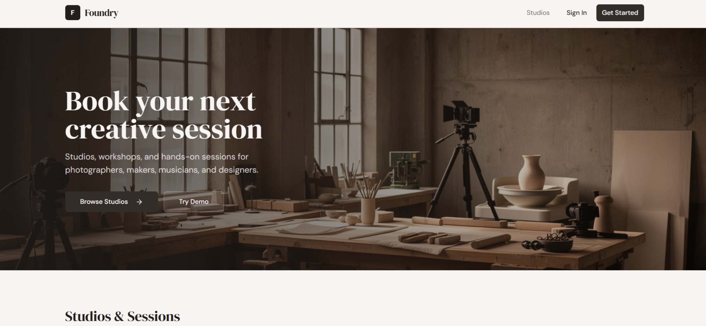
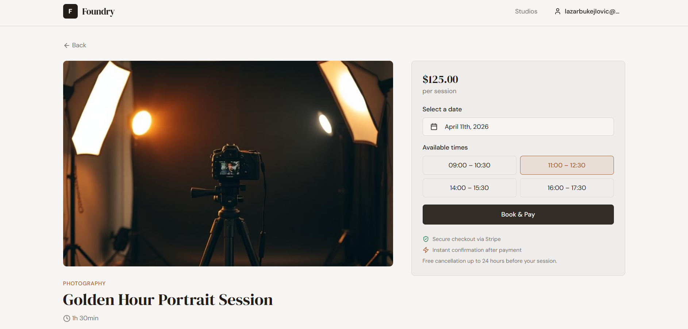
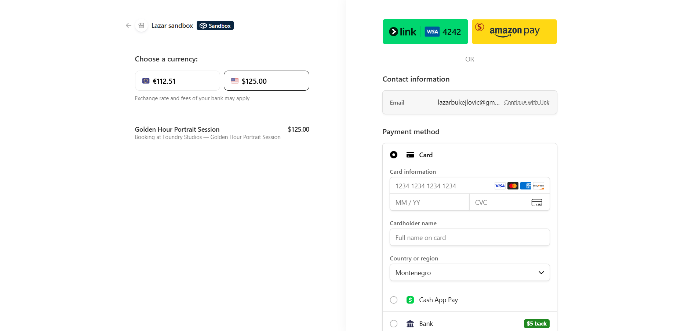
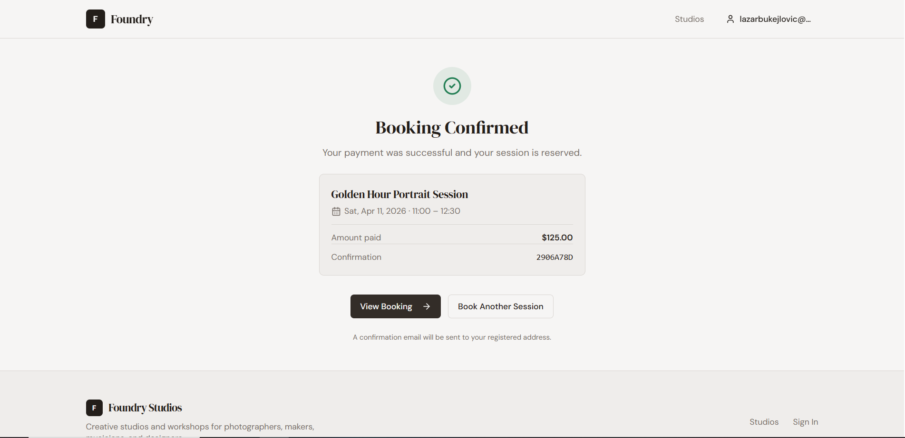

# Foundry Studios

Foundry Studios is a booking platform for creative spaces and sessions, built to feel like a real product rather than a portfolio-only mockup.

The project focuses on the parts that usually separate a presentable UI from a believable service: structured discovery, account-aware reservation flow, checkout, and post-booking state inside the user area.

## Overview

This project was built around a simple goal: make a booking app feel usable.

Instead of stopping at cards and static pages, Foundry Studios moves through the parts that matter in an actual product:
- discovery
- session details
- date and time selection
- reservation flow
- Stripe sandbox checkout
- success state
- booking management after payment

That gives it a more complete product feel than a standard portfolio dashboard or landing-page-only build.

## Core Features

- Browse creative spaces and sessions through a structured booking flow
- View session details, availability, and reservation information
- Move through a real booking journey from selection to checkout
- Test the payment flow safely with Stripe sandbox mode
- Access booking states inside the user account area
- Review and manage bookings after checkout
- Use the platform comfortably on both desktop and mobile

## Product Focus

The main focus of Foundry Studios is flow.

The project was designed around questions like:
- Does the user journey make sense from discovery to payment?
- Does checkout feel like part of the product instead of a detached step?
- Does the post-booking experience still feel intentional?
- Does the app hold together on smaller screens?

That is what gives the project more weight than a visually polished but shallow demo.

## Why it stands out

Foundry Studios is stronger than a typical portfolio app because it does more than present interface sections.

It also includes:
- booking logic
- payment flow
- user state transitions
- post-checkout behavior
- account-facing booking management

That combination makes it feel closer to a real service.

## Payments

Payments are handled through **Stripe sandbox/test mode**, which allows the checkout experience to be explored without real charges.

This matters because the payment step changes the feel of the whole project. It turns the app from a concept into something much closer to an actual product.

## Mobile Experience

The booking flow was built with mobile use in mind:
- browsing stays clear on smaller screens
- important actions remain easy to reach
- checkout and booking states remain readable
- spacing and hierarchy stay usable without feeling cramped

## Tech Direction

Foundry Studios was built as a modern web product with a frontend-first interface and real product flow behind it.

Main areas involved:
- React
- TypeScript
- authentication and account state
- Stripe sandbox checkout
- responsive product UI

## What this project was meant to prove

With this project, the goal was not just to show styling.

It was meant to show:
- stronger product thinking
- more complete UX flow
- payment integration in a believable context
- better portfolio depth than a static booking mockup
- a web app that feels closer to a usable service

## Screenshots

## Screenshots

### Landing Overview

### Booking Flow

### Checkout & Payments

### Booking Confirmation

## Live Demo

**Live:** https://foundry-studios.lovable.app/ 

**Repository:** https://github.com/lazarbukejlovic-dotcom/foundry-studios

## Author

**Lazar Bukejlovic**
